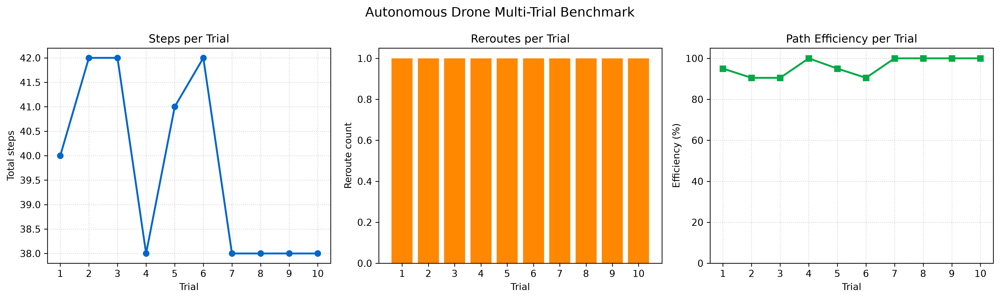
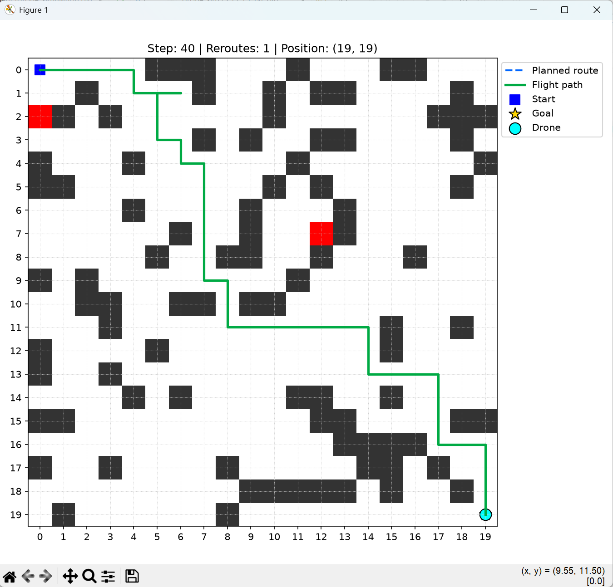
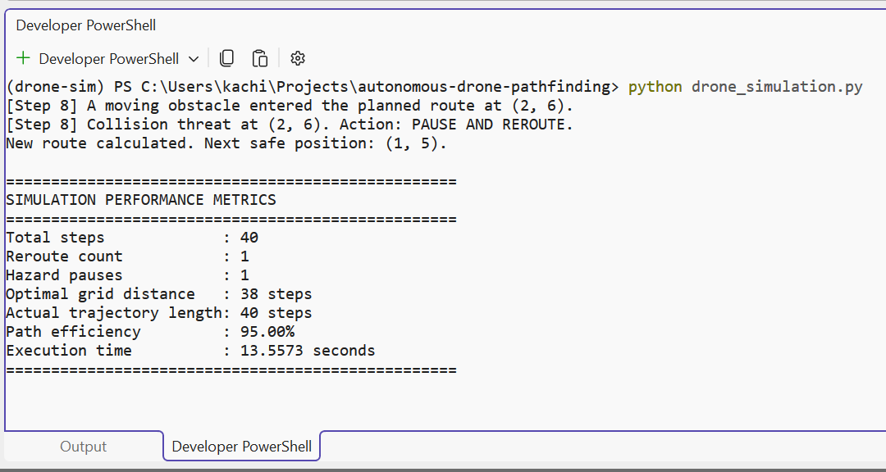

# Autonomous Drone Pathfinding and Obstacle Avoidance

A Python-based simulation of an autonomous drone navigating a two-dimensional grid environment. The system uses the A* search algorithm to calculate an efficient route, detect moving obstacles, pause when a collision threat is identified, and dynamically recalculate a safe path to the destination.

## Features

- Reproducible 20 × 20 grid environment
- Randomly generated static obstacles
- Moving dynamic obstacles
- A* shortest-path search
- Manhattan-distance heuristic
- Virtual obstacle-sensing logic
- Collision detection and autonomous rerouting
- Animated real-time visualization
- Performance measurement and reporting

## Autonomous Decision Process

During each simulation step, the system:

1. Updates the positions of the dynamic obstacles.
2. Uses a virtual sensor map to inspect the drone’s next planned position.
3. Detects whether a moving obstacle has entered the route.
4. Pauses the drone when a collision threat is identified.
5. Recalculates the route using A*.
6. Continues toward the goal using the new safe path.

A controlled obstacle event occurs at step 8 to provide a reproducible demonstration of collision detection and dynamic rerouting.

## Technologies

- Python 3.11
- NumPy 2.4.6
- Matplotlib 3.11.1
- Python `heapq` priority queue

## Project Structure

```text
autonomous-drone-pathfinding/
├── drone_simulation.py
├── benchmark.py
├── requirements.txt
├── README.md
├── .gitignore
├── evidence/
│   ├── screenshots/
│   │   ├── simulation_completed.png
│   │   ├── performance_metrics.png
│   │   └── reroute_detection.png
│   ├── graphs/
│   │   ├── performance_summary.png
│   │   ├── trajectory_heatmap.png
│   │   └── benchmark_summary.png
│   └── demo-video/
├── results/
│   ├── simulation_metrics.csv
│   └── benchmark_results.csv
└── report/
```

## Installation

Clone the repository:

```bash
git clone https://github.com/kachionyenokwe/autonomous-drone-pathfinding.git
cd autonomous-drone-pathfinding
```

Create and activate a Conda environment:

```bash
conda create -n drone-sim python=3.11 -y
conda activate drone-sim
```

Install the required packages:

```bash
pip install -r requirements.txt
```

## Running the Simulation

```bash
python drone_simulation.py
```

The program opens an animated Matplotlib window showing:

- Static obstacles in black
- Dynamic obstacles in red
- The planned route as a blue dashed line
- The completed flight trajectory as a green line
- The drone in cyan
- The start position as a blue square
- The destination as a gold star

When the drone reaches the destination, the terminal displays the performance metrics.

## Performance Metrics

The simulation measures:

- Total simulation steps
- Number of route recalculations
- Number of hazard pauses
- Optimal Manhattan distance
- Actual trajectory length
- Path-efficiency percentage
- Execution time

## Multi-Trial Benchmark

The simulation was evaluated across 10 successful trials using different
reproducible random seeds. One additional seed was rejected because its
generated environment contained no valid initial route.

| Metric | Result |
|---|---:|
| Successful trials | 10 |
| Failed seeds | 1 |
| Average steps | 39.70 |
| Average reroutes | 1.00 |
| Average hazard pauses | 1.10 |
| Average path efficiency | 96.14% |
| Efficiency standard deviation | 4.39% |
| Average algorithm execution time | 0.000790 seconds |

The benchmark measures algorithm execution without animation delays.

### Benchmark Visualization



## Evidence

### Completed Simulation



### Performance Metrics



### Dynamic Rerouting


## AI-Assisted Development

AI-assisted tools were used during development to support initial code generation, debugging, documentation, and refinement. The final implementation was manually reviewed, executed, tested, and validated to confirm that it meets the project requirements.

## Author

Kachi Onyenokwe